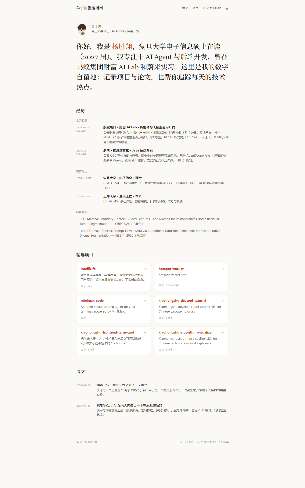

# 羊宇宙漫游指南

> 在羊的宇宙里漫游——杨胜翔的个人博客，也是一座每日热点追踪站。

[](https://github.com/hitsuji-shouka/hotspot-tracker/actions/workflows/deploy.yml)

**在线访问**：<https://hitsuji-shouka.com/> ｜ **热点追踪**：<https://hitsuji-shouka.com/hotspot> ｜ **GitHub**：[@hitsuji-shouka](https://github.com/hitsuji-shouka)

## 截图

| 个人首页 | 热点追踪站 |
| --- | --- |
|  |  |

## 站点地图

| 页面 | 内容 |
| --- | --- |
| `/` | 简历页：自我介绍、实习经历、教育经历、科研论文、精选 GitHub 项目 |
| `/shelf` | 漫游：影视 / 书籍 / 音乐书架（`src/data/shelf.ts` 维护） |
| `/blog` | 博客列表（`src/posts/*.md`） |
| `/post/:slug` | 博文详情页（Markdown 渲染，支持标签与日期） |
| `/hotspot` | 热点追踪站：GitHub 热点、Agent Skills、论文热点、AI 新闻、财经看点、统一收藏 |

## 功能

- **个人博客**：极简编辑风首页，自动拉取 GitHub 头像与按 Star 排序的精选仓库；博文存放在 `src/posts/*.md`，frontmatter 支持 `title / date / tags / summary`。
- **GitHub 热点**：按语言 / 主题分类，支持今日 / 本周 / 本月时间范围、关键词搜索与限流兜底提示。
- **每日榜单**：GitHub 项目、Agent Skills、Hugging Face 论文、AI 新闻四个榜单由服务器定时任务每天早间更新（`update_snapshots.py`，cron 08:10）。
- **每日推送**：本地定时任务每天早间推送 Skills / GitHub / 论文 / AI 新闻 Top10（08:14–08:20，增量去重）。
- **统一收藏**：网址、仓库、Skill、论文、文章收藏集中在一个 Tab，通过 `/api/sync` 在服务器端持久化，手机与电脑数据一致。旧 `/reading` 地址跳转至 `/hotspot?view=fav&tab=articles`，文章继续使用 `readingArticles` 同步键。
- **文章标签**：支持自定义主题与图标；同名标签忽略大小写合并计数和筛选。手机端标签为单行横向滑动，桌面端常用标签优先，其余可展开。
- **文章导入**：手动填写链接和标题，简介与标签选填，不依赖外部预览服务；来源按链接自动识别，点击标题打开原文，删除收藏后可撤销。

## 技术栈

- 前端：React 19 · TypeScript · Vite · Tailwind CSS · shadcn/ui · lucide-react
- 服务端：Node.js 静态服务 + `/api/sync`（`server.mjs`，systemd 常驻）
- 基础设施：阿里云 ECS · Cloudflare 命名隧道（HTTPS，免备案）· GitHub Actions CI/CD

## 本地开发

```bash
npm install
npm run dev
```

## 部署

- **日常**：`git push origin main` 即可——GitHub Actions 会自动构建并发布到 ECS（commit message 加 `[skip ci]` 可跳过）。
- **手动**：`npm run build && DEPLOY_PASS='服务器密码' npm run deploy`（也支持 `DEPLOY_KEY` 私钥）。
- 部署只替换服务器上的 `index.html` 与 `assets/`，不影响 `dist/data` 榜单数据与 `sync-data.json` 收藏数据。

## 目录结构

```
src/pages/      页面：博客首页 / 热点追踪 / 博文详情
src/sections/   追踪站各数据源模块（Skills、论文、AI 新闻、财经、收藏…）
src/posts/      Markdown 博文
src/lib/        GitHub API、缓存、文章加载等工具
scripts/        每日榜单与推送脚本、部署脚本
public/         站点图标与静态资源
```

## 数据来源

GitHub Search API · skills.sh · Hugging Face Papers · 量子位 · Hacker News · 新浪财经。收藏与同步数据保存在服务器 `sync-data.json`，仓库中不包含任何密码或密钥。
