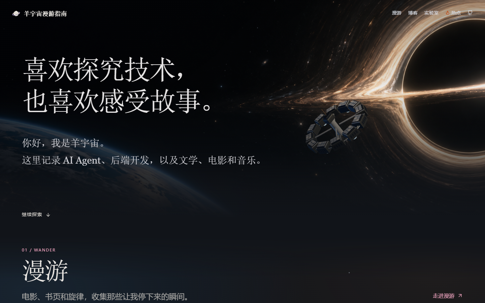
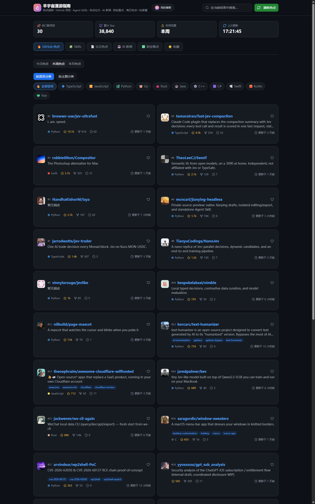

# 羊宇宙漫游指南

> 在羊的宇宙里漫游——杨胜翔的个人博客，也是一座每日热点追踪站。

[](https://github.com/hitsuji-shouka/hotspot-tracker/actions/workflows/deploy.yml)

**在线访问**：<https://hitsuji-shouka.com/> ｜ **热点追踪**：<https://hitsuji-shouka.com/hotspot> ｜ **GitHub**：[@hitsuji-shouka](https://github.com/hitsuji-shouka)

## 截图

| 个人首页 | 热点追踪站 |
| --- | --- |
|  |  |

## 站点地图

| 页面 | 内容 |
| --- | --- |
| `/` | 一屏太空首页：地球与黑洞之间的动态 3D 飞船和个人介绍 |
| `/shelf` | 漫游：影视 / 图书 / 音乐分类书架（`src/data/shelf.ts` 维护） |
| `/blog` | 博客与原学习文章合并展示（`src/posts/*.md`、`src/study/*.md`） |
| `/post/:slug` | 文章详情页（旧 `/study/:slug` 自动跳转） |
| `/hotspot` | 热点追踪站：GitHub 热点、Agent Skills、论文热点、AI 新闻、财经看点、统一收藏 |
| `/lab` | 实验：按分类浏览实验卡片 |
| `/lab/sheep-room` | 羊的小屋：进入 3D 小屋，填写房间想法，观看 AI 逛店并选择购物清单，最后生成概念效果图（需单独配置服务） |

## 功能

- **个人首页**：深空场景中，Blender 建模的环形飞船由 Three.js 驱动，从地球驶向黑洞。`scripts/build_journey_ship.py` 可重新生成可编辑的 `.blend` 和网页使用的 `.glb`。视觉参考包括 [devPilot 的 Endurance 模型](https://sketchfab.com/3d-models/interstellar-endurance-901fec2809704b74bec891e9a40a8726)；本站飞船网格由脚本独立构建。博客同时读取 `src/posts/*.md` 与 `src/study/*.md`；长文可使用 `layout: essay`、`updated` 和 `audience`，写法见 [博客写作模板](docs/blog-writing.md)。仅在文章明确提供 `cover: /图片路径` 时展示封面。
- **GitHub 热点**：按语言 / 主题分类，支持今日 / 本周 / 本月时间范围、关键词搜索与限流兜底提示。
- **每日榜单**：GitHub 项目、Agent Skills、Hugging Face 论文、AI 新闻四个榜单由服务器定时任务每天早间更新（`update_snapshots.py`，cron 08:10）。
- **每日推送**：本地定时任务每天早间推送 Skills / GitHub / 论文 / AI 新闻 Top10（08:14–08:20，增量去重）。
- **统一收藏**：网址、仓库、Skill、论文、文章收藏集中在一个 Tab，通过 `/api/sync` 在服务器端持久化，手机与电脑数据一致。旧 `/reading` 地址跳转至 `/hotspot?view=fav&tab=articles`，文章继续使用 `readingArticles` 同步键。
- **文章标签**：支持自定义主题与图标；同名标签忽略大小写合并计数和筛选。手机端标签为单行横向滑动，桌面端常用标签优先，其余可展开。
- **文章导入**：手动填写链接和标题，简介与标签选填，不依赖外部预览服务；来源按链接自动识别，点击标题打开原文，删除收藏后可撤销。
- **管理口令**：访客只读，页脚「管理」解锁后可操作所有收藏及热点爱心。浏览器凭证有效期 30 天，过期后重新输入同一口令。部署配置见 [管理口令](docs/admin.md)。
- **羊的小屋**：Luna 在隔离的浏览器里逛宜家，页面同步展示真实店铺画面；只收录能从商品详情页核对价格的家具。效果图为概念图，购买前需在商家页面核对。未配置服务时页面如实显示未开通。

## 技术栈

- 前端：React 19 · TypeScript · Vite · Tailwind CSS · shadcn/ui · lucide-react
- 服务端：Node.js 静态服务 + `/api/sync`（`server.mjs`，systemd 常驻）
- 基础设施：阿里云 ECS · Cloudflare 命名隧道（HTTPS，免备案）· GitHub Actions CI/CD

## 本地开发

```bash
npm install
npm run dev
```

首页浏览器检查：`node scripts/home-ui-check.mjs`（需要本机 Chrome；非默认端口可设置 `HOME_CHECK_URL`）。

本地 API 代理指向 `127.0.0.1:8080`，需要另外启动 `server.mjs`。口令不配置时为只读；本地启用方法见上面的管理口令文档。

### 羊的小屋服务

Jev 选品：服务端同时设置 `JEV_API_KEY`（或 `TYPESAFE_API_KEY`）与 `ROOM_API_KEY`（或 `OPENAI_API_KEY`）、`ROOM_ENABLED=1`、`ROOM_BROWSER_EXECUTABLE` 和 `SITE_ORIGIN`。实现遵循 [browser-use/jev-ultrafast](https://github.com/browser-use/jev-ultrafast/tree/1231850a0bf1a0c0341fe408ef1668dbbfdfac46) 的“完整自然语言目标 → 当前页面编号元素 → 一次 Jev 请求选择操作及对应目标”循环；只有 Jev 选择搜索框的 `TYPE_TEXT` 时，文本模型才根据原始需求、已选商品和历史搜索词生成一个新搜索词。没有预先生成的家具清单，也没有固定家具词表。`JEV_MODEL` 默认 `jev-latest`，文字模型默认 `gpt-6-luna`，可通过 `ROOM_QUERY_MODEL` 调整。只有文本模型密钥时沿用 Luna 逛店；只有 Jev 密钥时不能生成搜索文字。浏览器执行器仍为本项目已有的 Node/Playwright，保留实时画面、宜家商品核验、去重和预算限制。上游仓库的 Python 3.12 + Browser Harness 运行时没有直接打进 ECS 包，因为现有线上服务是 Node/systemd；此处移植的是它的决策循环，而非直接运行其 Python 包。

本地密钥放入 Git 忽略的 `.env.jev`，运行 `node --env-file=.env.jev server.mjs 4192`，对应 `SITE_ORIGIN=http://127.0.0.1:4192`。`GET /api/room/status` 返回 `available`、`provider` 和 `renderAvailable`，不返回密钥。效果图仍需另外配置支持图片编辑的服务；文本搜索可用并不代表生图接口可用。`node scripts/room-jev-check.mjs` 可免费验证动态操作/目标、搜索文字边界、预算、异常和取消。`node scripts/room-jev-browser-check.mjs` 用真实宜家页面和确定性动作验证浏览器搜索、打开商品、入袋及画面流，不调用付费模型；需要可联网的 Chrome 或设置 `ROOM_BROWSER_EXECUTABLE`。

以下为原有 Luna 选品及效果图配置（没有 Jev 密钥时使用 Luna）：

`server.mjs` 需要设置 `SITE_ORIGIN`、`ROOM_API_KEY`（或官方 OpenAI 用的 `OPENAI_API_KEY`）、`ROOM_BROWSER_EXECUTABLE`（服务器上的 Chromium/Chrome 可执行文件绝对路径）和 `ROOM_ENABLED=1` 才会开放逛店。密钥只放在服务器环境变量，不写入前端或仓库；默认不开通。`SITE_ORIGIN` 必须与用户浏览器访问站点时的 Origin 完全一致，本地例如 `http://127.0.0.1:4186`。官方接口默认使用 `https://api.openai.com/v1`、`gpt-6-luna` 和 `gpt-image-2`；使用 AICode007 时设置 `ROOM_API_BASE_URL=https://api.aicode007.com`、`ROOM_TEXT_MODEL=gpt-5.6-luna`、`ROOM_IMAGE_MODEL=gpt-image-2`。如果本机 Node 24 需要通过 `HTTP_PROXY`/`HTTPS_PROXY` 出网，再设置 `NODE_USE_ENV_PROXY=1`。效果图只在选完商品后手动生成，每轮服务端只接受一次生图提交，失败不自动重试。为控制费用，服务端目前每天全站最多 30 次逛店、10 次效果图；每个来源地址每天最多 2 次逛店、1 次效果图，同时只运行一个逛店浏览器，重启服务后计数清零。服务端可用 `ROOM_QUOTA_EXEMPT_IPS` 配置逗号分隔的公网 IP；这些地址的逛店和生图不计入个人或全站每日额度，仍受并发保护。图片只返回给当前页面，不会保存到服务器；本轮商品记录在服务端内存中保留一小时。

逛店通过兼容 OpenAI Responses API 的函数调用驱动 Playwright 浏览器，Luna 只读取网页文字，选择搜索、点击、滚动、明确加入小屋购物袋或结束。仅浏览商品不会入袋；名称、规格、照片和人民币价格从当前详情页核实，重复或超预算商品不能加入。用户选择使用独立的「小屋购物袋」，不调用商家加购，也不需要登录。Chrome CDP 连续画面和真实鼠标事件同步至 3D 电脑屏幕，入袋事件驱动黑板、照片提示、图册和完整清单。Luna 模式单轮最多 20 次决策，Jev 模式以时间为限；购物时间以分钟输入，默认 2.5 分钟，可在目标面板设为 0.5–10 分钟。镜头推进完成、服务端接受本轮后开始计时，包含浏览器启动和网页等待；到时中止模型请求并关闭逛店浏览器，保留已选商品与完整清单，不再接受入袋。也可以随时手动停止。

最后手动生成一次效果图：前端仅提交本轮 runId，服务端使用已核实清单和商品参考照片调用 `images/edits`；接口兼容性尚未实际生图验收，不会自动退回纯文字生图。效果图是搭配概念图，不保证实物外观或尺寸完全一致。`node scripts/room-check.mjs` 检查输入、图片来源和配额；`node scripts/room-stream-check.mjs` 验证本地浏览器连续帧；`node scripts/room-browser-check.mjs` 使用确定动作验证真实宜家搜索与入袋，后两项需要本机 Chrome，均不调用收费模型。详细流程和验收记录见 [体验改造与调研](design/sheep-room-experience.md)。部署前需配置服务端密钥、浏览器及长连接转发，并验收生图接口。

## 部署

- **日常**：`git push origin main` 即可——GitHub Actions 会自动构建并发布到 ECS（commit message 加 `[skip ci]` 可跳过）。
- **手动**：`npm run build && DEPLOY_PASS='服务器密码' npm run deploy`（也支持 `DEPLOY_KEY` 私钥）。
- 前端部署只替换服务器上的 `index.html` 与 `assets/`，不影响 `dist/data` 榜单数据与 `sync-data.json` 收藏数据。
- Actions 同时部署 `server.mjs`、`server-auth.mjs` 并重启 `hotspot-tracker.service`，先验证未解锁的写入被拒绝，再发布前端；服务器口令配置独立保存在 `/etc/hotspot-tracker.env`。手动 `deploy.py` 仍只发布前端。

## 目录结构

```
src/pages/      页面：博客首页 / 热点追踪 / 博文详情
src/sections/   追踪站各数据源模块（Skills、论文、AI 新闻、财经、收藏…）
src/posts/      Markdown 博文
src/lib/        GitHub API、缓存、文章加载等工具
scripts/        每日榜单与推送脚本、部署脚本
public/         站点图标与静态资源
```

## 数据来源

GitHub Search API · skills.sh · Hugging Face Papers · 量子位 · Hacker News · 新浪财经。收藏与同步数据保存在服务器 `sync-data.json`，仓库中不包含任何密码或密钥。
