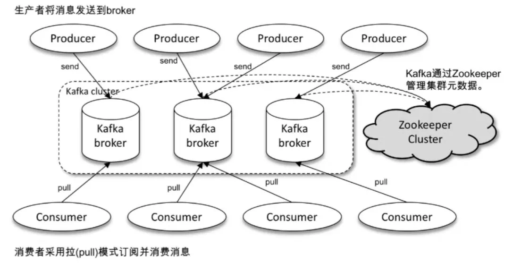
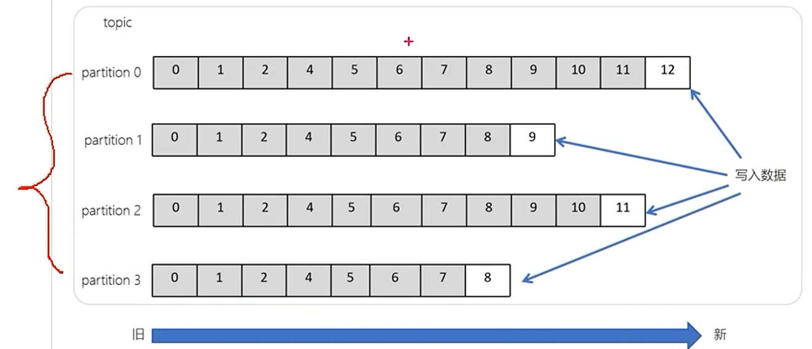

## 消息队列
### 消息队列的作用
解耦、异步、削峰填谷

### 消息队列对比和选型
| 对比维度 | RabbitMQ | RocketMQ | Kafka |
|---|---|---|---|
| 主要定位 | 消息路由、任务分发 | 业务消息、事件驱动 | 事件流、可回放的分布式日志 |
| 常见适用场景 | 异步任务、通知、复杂路由 | 订单事件、延迟任务、业务最终一致性 | 日志、埋点、数据同步、实时计算 |
| 核心组织方式 | Exchange → Queue → Consumer | Topic → MessageQueue → Consumer | Topic → Partition → Consumer |
| 消费成功后 | 普通队列中的消息确认后删除 | 按保留策略清理，不因一次消费成功立即删除 | 按保留或压缩策略清理，不因消费成功立即删除 |
| 历史消息回放 | 普通队列不支持消费后回放；Streams 支持 | 在保留范围内支持 | 核心能力，可调整消费位点重读 |
| 更值得关注的优势 | 路由灵活、任务分发机制丰富 | 延迟、重试、事务消息配套完整 | 持续大流量、多方订阅、回放与流处理 |

| 核心需求 | 优先评估 | 判断理由与条件 |
|---|---|---|
| 日志、埋点、CDC、多套系统独立消费同一事件流 | Kafka | 更符合持续存储、回放、流处理的使用方式 |
| 订单超时关闭、延迟触发、内置业务重试 | RocketMQ | 原生业务消息能力可减少外围实现 |
| 数据库事务成功后可靠发布业务事件 | RocketMQ，或现有 MQ＋Outbox | 看是否需要事务回查，以及团队能否维护对应方案 |
| 复杂路由、按规则分发到多个任务队列 | RabbitMQ | Exchange 与 Queue 的组合表达直接 |
| 普通异步任务，如发邮件、生成报表 | 优先现有成熟 MQ；新建可评估 RabbitMQ | 流量不大时，维护成本往往比峰值吞吐更重要 |
| 同一订单的多个事件必须按顺序处理 | RocketMQ 或 Kafka；RabbitMQ 也可设计实现 | 关键是按订单分组，并控制组内并发及失败重试 |
| 大量历史消息需要长期保留、反复回放 | Kafka；已有 RabbitMQ 可评估 Streams | 重点比较存储成本、保留策略和恢复消费速度 |

## 核心概念
### 体系结构
消息队列（削峰填谷，解耦，异步），Kafka可以做消息队列
Kafka体系结构如下所示：
Kafka包含Producer, Broker, Consumer以及一个Zookeeper集群
- Zookeeper是kafka用来负责集群元数据管理、控制器选举等操作的
- Producer是负责将消息发送到Broker的
- Broker负责接收消息，将消息持久化到磁盘

### Broker
- 一个Kafka的集群通常由多个Broker组成，这样才能实现负载均衡、以及容错
- Broker是无状态（Sateless）的，它们是通过ZooKeeper来维护集群状态
- 一个Kafka的Broker每秒可以处理数十万次读写，每个Broker都可以处理TB消息而不影响性能

### Zookeeper
- ZK用来管理和协调 Broker，并且存储了Kafka的元数据（例如：有多少topic、partition、consumer、producer）
- ZK服务主要用于通知生产者和消费者Kafka集群中有新的Broker加入、或者Kafka集群中出现故障的Broker。

Kafka正在逐步想办法将ZooKeeper剥离，维护两套集群成本较高，社区提出KIP-500就是要替换掉ZooKeeper的依赖。“Kafka on Kafka”——Kafka自己来管理自己的元数据

### Topic
Kafka中Topic是一个逻辑概念
- 所谓发布订阅机制
  - 生产者发布的消息是需要指定一个Topic的，含义即这个消息属于这个“主题”Topic，也可以把“主题”理解为“类别”，生产者就会把消息发送到所指定的Topic。
  - 通常一个Topic中只会专门存储某一类的（消息）信息，比如 Topic（A）专门存储用户观看直播时长信息、Topic（B）专门存储直播PK开始信息。并且在一个Topic中的消息是有固定结构的。
  - 消费者是从它所指定订阅的 “主题”Topic 中去拉取的。
- 一个主题Topic被分成多个Partition分区

### Partition

一个Topic被分成多个Partition分区（Topic是逻辑概念，无实体）
- Partition分区 是最小的存储单元，掌握着一个Topic的部分数据。
- 每个 Partition 分区都是一个单独的 log 文件，每条记录都以追加的形式写入。
- 一个 Topic 的所有 Partition分区 是分布在多个不同的Broker中的，所有 Partition 分区的数据的并集就是所有数据
- 一个 Topic 的所有 Partition 放在不同的Broker上，可以提高容错率、提高消息的消费能力。

> 原因解释：消费者需要消费A类消息，它要去 Broker 中的 Partition分区 (log文件) 获取数据。假设有三个Broker（B1、B2、B3），其上存在 Partition ，如果一个 Topic 的所有 Partition 都存储在 B1 中，此时所有消费者都来 B1 中获取A类消息。如果B1宕机了，又因为只有 B1 上才拥有这个 Topic 的所有Partition，即A类信息只存于B1上，此时这些消费者就无法读取到信息了。但是如果一个 Topic 的Partition 分区是分布在多个不同的 Broker 中的话，那么即使B1宕机了，在B2中也存在这个Topic的Partition，此时消费者可以到B2获取这类信息消费。另外如果把一个Topic的所有Partition都放在一个Broker上，那么这个Topic消息的消费能力将会受限于一个Broker的IO能力
- 一个 Partition 会生成多个副本Replica，并且把它们分散存储在不同的 Broker 中
> 原因解释：刚刚解释了为什么一个 Topic 中的所有 Partition 要分布在不同的 Broker 上，但是还有一个问题，因为所有的 Partition 的并集数据才是全量数据，假设某个Broker宕机了，在这个Broker上存在P0分区，此时P0分区所拥有的消息就无法被读取了。且P0分区所拥有的消息是唯一的。因此此时副本就出现了，一个Partition复制多份副本，分散存储在不同的Broker中，此时如果某Broker宕机了，但在其上的P0分区的消息并不是唯一的，在其他未宕机的Broker中有P0分区副本，依然可以获取P0分区的消息。
- 在Kafka中，一般都会设计副本 Replica 的个数 > 1

### Offset
#### 定义
- Offset 是一个递增的、不可变的数字，当一条记录写入 Partition 的时候，它就被追加到该 Partition 对应的 log 文件的末尾，并被分配一个序号，作为 Offset。即使消息被删除或过期，Offset 也不会改变或重用。
- Offset 是 Kafka 为每条消息分配的一个唯一的编号，它表示消息在分区中的顺序位置。
- Offset 是从 0 开始的，每当有新的消息写入 Partition 时，Offset 就会加 1。

#### 作用
- offset 的作用主要有两个：
    - 一是用来定位消息。通过指定 offset，消费者可以准确地找到分区中的某条消息，或者从某个位置开始消费消息。
- 二是用来记录消费进度。
    - 消费者在消费完一条消息后，需要提交 offset 来告诉 Kafka broker 自己消费到哪里了。这样，如果消费者发生故障或重启，它可以根据保存的 offset 来恢复消费状态。

#### 存储
- 老版本默认Kafka将Offset存储在Zookeeper中
- Kafka 0.9.0 版本后，offset 的实际存储位置都是在 Kafka 的一个内置主题中：consumer_offsets。这个主题有 50 个分区（可配置），每个分区存储一部分消费组（Consumer Group）的 offset 信息。Kafka broker 会根据消费组 ID 和主题名来计算出一个哈希值，并将其映射到 consumer_offsets 主题的某个分区上。

consumer_offsets 主题是 Kafka 0.9.0 版本引入的新特性，之前的版本是将 offset 存储在 Zookeeper 中。但是 Zookeeper 不适合大量写入，因此后来改为存储在 Kafka 自身中，提高了性能和可靠性。

#### Offset的提交和重置
提交 offset 是消费者在消费完一条消息后，将当前消费的 offset 值更新到 Kafka broker 中的操作。提交 offset 的目的是为了记录消费进度，以便在消费者发生故障或重启时，能够从上次消费的位置继续消费。

重置 offset 是消费者在启动或运行过程中，将当前消费的 offset 值修改为其他值的操作。重置 offset 的目的是为了调整消费位置，以便在需要重新消费或跳过某些消息时，能够实现这个需求。

**提交offset**

消费者在消费 Kafka 消息时，需要维护
- 当前消费的 offset 值，表示消费者正在消费的消息的位置
- 已提交的 offset 值，表示消费者已经跟Kafka确认了已消费过的消息的位置。

消费者在消费完一条消息后，需要提交 offset 来更新已提交的 offset 值。

提交 offset 的方式有两种：自动提交和手动提交。
- 自动提交：Kafka 提供了一个配置参数 enable.auto.commit，默认为 true，表示开启自动提交功能。自动提交功能会在后台定期（由 auto.commit.interval.ms 参数控制）将当前消费的 offset 值提交给 Kafka broker。
- 手动提交：如果 enable.auto.commit 设置为 false，则表示关闭自动提交功能，此时消费者需要手动调用 commitSync 或 commitAsync 方法来提交 offset。手动提交功能可以让消费者更灵活地控制何时以及如何提交 offset

需要注意的是，无论是自动提交还是手动提交，都不保证提交成功。因为 Kafka broker 可能发生故障或网络延迟，导致提交失败或延迟。因此，消费者需要处理提交失败或延迟的情况。
- 提交失败：如果提交失败，消费者可以选择重试或放弃。重试的话，可能会导致多次提交同一个 offset 值，但是不会影响正确性，因为 Kafka broker 会忽略重复的 offset 值。放弃的话，可能会导致下次启动时重新消费已经消费过的消息。
- 提交延迟：如果提交延迟，消费者可以选择等待或继续。等待的话，可能会导致消费速度变慢，或者超过 session.timeout.ms 参数设置的时间而被认为已经死亡。继续的话，可能会导致下次启动时漏掉一些没有提交成功的消息。

**重置offset**

重置 offset 的方式有两种：手动重置和自动重置。手动重置是指消费者主动调用 seek 或 seekToBeginning 或 seekToEnd 方法来修改当前消费的 offset 值。自动重置是指消费者在启动时根据 auto.offset.reset 参数来决定从哪个位置开始消费。
- 手动重置：手动重置可以让消费者精确地控制从哪个位置开始消费。例如，如果想要重新消费某个分区的所有消息，可以调用 seekToBeginning 方法将 offset 设置为 0；如果想要跳过某个分区的所有消息，可以调用 seekToEnd 方法将 offset 设置为最大值；如果想要从某个具体的位置开始消费，可以调用 seek 方法将 offset 设置为任意值。
- 自动重置：自动重置可以让消费者在启动时根据 auto.offset.reset 参数来决定从哪个位置开始消费。auto.offset.reset 参数有三个可选值：earliest, latest 和 none。earliest 表示从最早的可用消息开始消费；latest 表示从最新的可用消息开始消费；none 表示如果没有可用的 offset，则抛出异常。

### 消费者组
多个消费者，只要指定了相同的 group_id ，即属于同一个消费者组

同一个消费者组内的消费者可以共同消费一个Topic中的数据，
但是一个Topic中是有很多Partition的，消费者是怎么分配 Partition 的呢？
- 例1：有一个Topic，含有一个Partition，有一个消费者组（有消费者A，B），此时消费者A和消费者B中只有一个消费者可以消费到消息，另外一个消费者将不会消费到消息。这说明当一个消费者组内的消费者数量 > 某 Topic 的 Partition 数量时，多余的消费者是会空闲的。
- 例2：有一个Topic，含有两个Partition，有一个消费者组（有消费者A，B），此时消费者A和消费者B会分别单独只消费某一个Partition，A和B不会交叉消费不同Partition。这说明当一个消费者组内的消费者数量 == 某 Topic 的 Partition 数量时，每个消费者对应一个Partition。
● 例3：有一个Topic，含有三个Partition，有一个消费者组（有消费者A，B），此时消费者A和消费者B会有一个消费者消费多个分区。这说明当一个消费者组内的消费者数量 < 某Topic的Partition数量时，部分消费者会消费多个Partition的消息。

不同消费者组也可以共同消费同一个Topic中的数据。
- 假设消费者组 A 和消费者组 B 都订阅了同一个 Topic，那么两个消费者组都能独立消费该 Topic 的消息。对于同一条消息，A 组会消费一次，B 组也会消费一次。在每个消费者组内部，一条消息只会交给其中一个消费者处理。

### Partition和消费者组内消费者数量
针对单个消费者来说：
- 若消费者数量大于partition数量，会造成闲置的消费者，产生浪费；
- 若消费者数量小于partition数量，会导致均衡失效，其中的某个或某些消费者会消费更多的任务；

因此，一般消费者组内消费者的数量应该等于Partition的数量；  

但是如果需要消费的任务压力不大，也可以是第二种情况，即消费者的数量小于分区的数量；

### 单播消费
同一个消费者组内，同一分区的每条消息在同一时刻只会分配给一个消费者处理；不同消费者组之间互不影响，可以分别消费同一条消息。

### 多播消费
- 针对 Kafka 同一条消息只能被同一个消费组下的某一个消费者消费的特性，要实现多播只要保证这些消费者属于不同的消费组即可。
- 假设有两个消费者组A和B，结果是A消费者组和B消费者组中各有一个消费者成功消费到消息。
- 多播消费其实是一条消息能被多个消费者 (不同的消费者组) 消费的模式。

### TIPS
- Kafka是以消费者来 “拉”信息的模式工作的，而非“推”模式。消费者主动向 Broker 请求拉取消息。消费者通过 poll() 方法定期轮询 Broker，并根据自身消费能力控制拉取频率和批量大小
- Kafka中存储的消息是以key、value形式存储的
- 通常一个Topic中只会专门存储某一类的（消息）信息，并且在一个Topic中的消息是有固定结构的
- 一个主题Topic中的所有Partition分区是分布在不同的Broker节点上的
- 请注意Offset的定义和作用
- 一般一个Topic被一个指定的消费者组消费，组中的消费者数量等于Partition数量。

## 面试整理
### 广播和队列怎么实现？原理是什么？
队列模式：一个partition, 一个consumer group内只会有一个consumer消费

广播模式：不同consumer group各自消费一份

### Kafka的高吞吐

核心原理：顺序写入日志文件  + Zero Copy提高性能 + 批量写

1. 顺序写磁盘：Kafka 不会像传统数据库那样在磁盘上随机读写（Random I/O）数据。相反，它将消息以追加（Append-Only）的方式写入日志文件（Log Segment）。这意味着它总是在文件的末尾添加新数据，这是一个纯粹的顺序写操作。
2. 零拷贝： 零拷贝主要用在消费者从 Kafka Broker (服务器) 读取数据的环节，它极大地提升了数据传输的效率。  
    1. Kafka 的零拷贝流程（2 次拷贝，0 次用户态拷贝）：
        1. 操作系统从磁盘读取数据到内核的“页缓存”中。
        2. 通过 sendfile 指令，数据直接从“页缓存”拷贝到网卡（或套接字缓存再到网卡，具体取决于硬件支持）。
    2. 数据完全没有进入 Kafka 应用程序（用户空间），CPU 不需要执行任何拷贝操作。	
3. 批量写：Kafka 不会每收到一条消息就立刻处理它，而是将多条消息打包成一个“批次”（Batch），然后一次性处理这个批次，极大减少了网络请求的次数。 

### Kafka如何保证消息不丢失

1. 生产者发送消息到broker丢失：设置异步回调发送消息，设置重试机制应对网络问题。
2. 消息在broker中存储丢失：在Broker中通过复制机制来保证消息不丢失，在生产者发送消息的时候，可以设置acks参数为all，确保消息在所有副本中都得到确认。 
3. 消费者从broker接收消息丢失：消费者手动提交消费成功的offset，避免自动提交可能导致的数据丢失或重复消费。
    1. kafka中的分区机制指的是将每个主题划分成多个分区(Partition)
    2. topic分区中消息只能由消费者组中的唯一一个消费者处理，不同的分区分配个不同的消费者(同一个消费者组)
    3. 消费者默认是自动按期提交已经消费的偏移量，默认是每隔5s提交一次，如果出现重平衡的情况，可能会出现数据丢失或重复消费。如果消费者组中的某个消费者宕机，那么就需要其他的消费者来负责消费其指定的分区，这就是重平衡现象。

### kafka如何保证消息不重复消费
1. 启用Kafka生产者幂等性  
Kafka生产者可以通过启用幂等性来避免消息重复发送：
- 配置：设置 enable.idempotence=true，确保生产者发送的消息具有唯一性。
- 原理：Kafka 会为每条消息分配一个唯一的序列号（Sequence Number），并在 Broker 端进行去重，从源头避免消息重复。

2. 消费者端实现幂等性/去重
- 即使生产者启用了幂等性，消费者仍然可能因为某些原因（如消费者重启、偏移量提交失败等）重复消费消息。因此，消费者端需要实现幂等性：确保相同的消息被多次处理时，不会对系统状态产生影响。
- 在消费者端维护一个已处理消息的标识（如消息 ID 或业务主键如订单ID）并在处理消息前检查是否已经处理过，例如使用 MySQL 存储已处理的消息 ID 或业务主键。

### kafka如何保证消费的顺序性
Topic分区中消息只能由消费者组中唯一一个消费者处理，所以消息肯定是按照先后顺序处理的。但是它也仅仅是保证Topic的一个分区顺序处理，不能保证跨分区的消息先后处理顺序，所以要想顺序处理Topic的所有消息，那就只提供一个分区。
- 问题原因：

一个topic的数据可能存储在不同的分区中，每个分区都有一个按照顺序的存储的偏移量，如果消费者关联了多个分区不能保证顺序性（消费者数小于分区数）。
- 解决方案（多个消息写入同一个Topic的同一个Partition分区中），有两种方式：
    - 发送消息时指定分区号
    - 发送消息时按照相同的业务设置相同的key(默认分区策略是通过key来计算hash值的)

### Rebalance机制
1. 背景知识：一个消费者组可以订阅多个Topic
2. Kafka中的Rebalance称之为重平衡
    1. 是Kafka中确保消费者组下所有消费者如何达成一致，分配（订阅的Topic的）分区的机制
3. Rebalance触发的时机
    1. 消费者组中消费者的个数发生变化，例如有新的消费者加入消费者组，或者某个消费者停止了
    2. 消费者组订阅的 Topic 的 Partition 个数发生变化，Partition的个数增加或减少
    3. 消费者组订阅的 Topic 个数发生变化，订阅的Topic 个数增加或减少
    4. Rebalance的不良影响
        1. 发生Rebalance的时候，消费者组下的所有消费者都会协调在一起共同参与，Kafka使用分配策略，尽可能达到最公平的分配。
        2. Rebalance的过程会对消费者组产生非常严重的影响，Rebalance的过程中所有的消费者都将停止工作，直到Rebalance完成。
        3. 消费者从broker接收消息丢失：消费者自动提交offset可能会导致数据丢失或重复消费。

### 自动提交offset
offset: 消息位移，它表示分区中每条消息的位置消息，是一个单调递增且不变的值

换句话说，offset可以用来唯一地标识分区中每一条记录

Kafka为了让我们能够专注于自己的业务逻辑，提供了自动提交offset的功能，这也是默认配置项。
- 当消费者配置 enable.auto.commit=true 时，消费者会在后台启动一个定时任务，每隔 auto.commit.interval.ms（默认 5 秒）自动提交一次 offset
- 自动提交的 offset 存储在 Kafka 的内部系统主题consumer_offsets中

### 消息堆积
1. 消费者端优化
    1. 消费者消费速度太慢，导致消息积压，可以优化消费者代码逻辑
    2. 当消费者数量少于partition分区数量时，可以增加消费者数量（但不能超过partition的数量）
    3. 当手动提交offset时，检查是否消费者未正确提交 offset，导致消费停滞
2. 生产者端优化
    1. 控制生产速度：例如在生产者端设置限流机制，避免消息生产速度过快
3. Kafka集群优化
    1. 调整分区数量：根据消息生产和消费速度，合理调整主题的分区数量。如果消息堆积是由于分区数过少导致，可增加分区数。例如，将一个原本只有2个分区的主题，根据业务量增加到10个分区，以提高并行处理能力。但分区数过多也会增加管理开销，需谨慎评估。

### Kafka高可用机制

集群模式：
- kafka的服务器端由被称为Broker的服务进程构成，即一个kafka集群由多个broker组成
- 如果集群中某一台机器宕机，其他机器上的broker也依然能够对外提供服务

分区备份机制（复制机制）：
- 一个topic有多个分区，每个分区有多个副本，其中有一个leader，其余的是follower，副本存储在不同的broker中
- 所有分区副本的内容都是相同的，如果leader发生故障时，会自动将其中一个follower提升为leader

### 解释一下复制机制中的ISR

ISR需要同步复制保存的follower

分区副本分为两类，一个是ISR，与leader副本同步保存数据，另外一个是普通的副本，是异步同步数据，当leader挂掉之后，会有先从ISR副本列表中选取一个作为leader，因为ISR是同步保存数据，数据更加的完整一些，所以优先选择ISR副本列表。

### ISR机制详解
ISR（In-Sync Replicas）机制定义

kafka保持一致性的核心机制，由Leader副本（负责读写）和Follower副本（负责备份）组成。

**ISR指的是与leader保持同步的follower副本**。这些副本已经复制了Leader副本的所有数据，并且它们的落后时间在一定范围内（由replica.lag.time.max.ms参数配置），因此被认为是可靠的、可以用于故障转移和数据恢复的副本。当Follower副本的延迟超过replica.lag.time.max.ms（默认10秒）时，会被移出ISR集合。

- 选举保证节点容灾‌：当Leader副本出现故障时，Kafka会从ISR集合中选举一个新的Leader副本。由于ISR中的副本与之前的Leader副本保持同步，新的Leader副本能够继续提供服务，而不会丢失数据。这确实保证了节点的容灾能力。

- Follower副本保证备份‌：ISR中的Follower副本不仅作为备份存在，它们还积极参与消息的复制过程。当消息被写入Leader副本时，Leader副本会将消息复制给ISR中的所有Follower副本。这样，即使Leader副本出现故障，ISR中的Follower副本也能提供完整的数据备份。

- ISR的动态管理‌：Kafka会动态地管理ISR集合。如果某个Follower副本无法跟上Leader副本的更新速度（即落后时间超过replica.lag.time.max.ms），它将被移出ISR集合。一旦该副本重新追上Leader副本，它将被重新加入ISR集合。这种动态管理机制确保了ISR集合中的副本始终是可靠的。

- 数据一致性保证：生产者在写入数据时，可以通过设置 acks 参数来控制数据的一致性级别。设置 acks=all（或acks=-1）：当消息被写入 Kafka 的分区时，它首先会被写入 Leader，然后 Leader 将消息复制给 ISR 中的所有副本。只有当 ISR 中的所有副本都成功地接收到并确认了消息后，主副本才会认为消息已成功提交。这种机制确保了数据的可靠性和一致性。

acks参数 仅支持以下三个值：
|取值|行为|
|---|---|
|0|不等待确认，直接发送下一条消息|
|1|等待Leader副本确认|
|all / -1|等待ISR中所有副本确认（需配置`min.insync.replicas`定义最小副本数）|

### kafka的数据清理机制了解过吗
kafka文件存储机制：每个分区里面是可能会分段保存文件的
为什么分段？
- 删除无用文件方便，提高磁盘利用率
- 查找数据便捷

日志的清理策略有两个：
1. 根据消息的保留时间，当消息在kafka中保存的时间超过了指定的时间，就会触发清理过程
2. 根据topic存储的数据大小，当topic所占的日志文件大小大于一定的阈值，则开始删除最久的消息，需要手动开启，默认是关闭的

### kafka实现高性能的设计有了解过吗
- 消息分区：不受单台服务器的限制，可以不受限的处理更多的数据
- 顺序读写：磁盘顺序读写，提升读写效率
- 页缓存：将磁盘中的数据缓存到内存中，把对磁盘的访问变为对内存的访问
- 零拷贝：减少上下文切换及数据拷贝
    - kafka将页缓存中的数据委托系统进行操作，直接从页缓存中拷贝到网卡传递给消费者。
- 消息压缩：减少磁盘IO和网络IO
- 分批发送：将消息打包批量发送，减少网络开销

