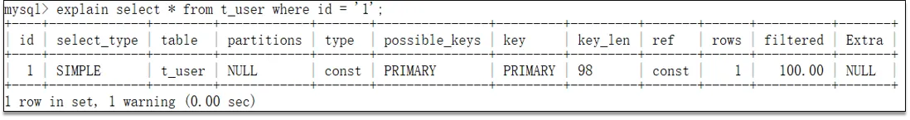
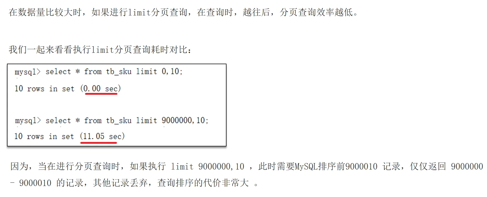
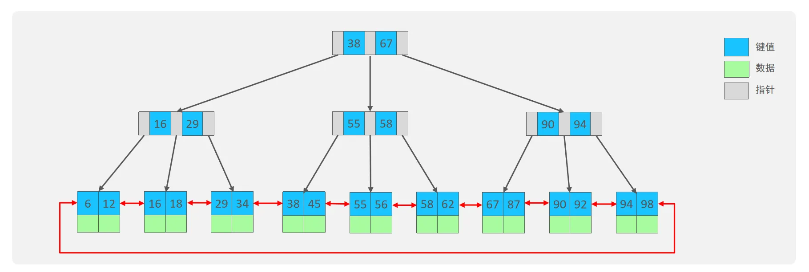
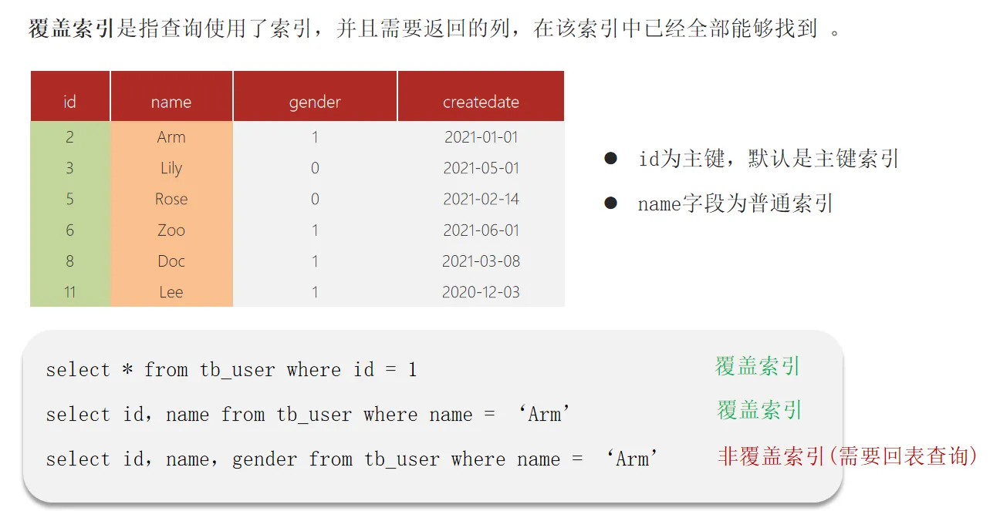

## 基础
### MySQL字段类型
- 数值类型
    - 整型（TINYINT, SMALLINT, MEDIUMINT, INT 和 BIGINT）
    - 浮点型（FLOAT和DOUBLE)
    - 定点型（DECIMAL）
- 字符串类型：CHAR 和 VARCHAR常用
- 日期事件类型：DATE，DATETIME，TIMESTAMP等

### 执行计划分析

优化SQL的第一步是读懂SQL的执行计划

**执行计划** 是指一条 SQL 语句在经过 **MySQL 查询优化器** 的优化后，具体的执行方式。

执行计划通常用于 SQL 性能分析、优化等场景。通过 EXPLAIN 的结果，可以了解到如数据表的查询顺序、数据查询操作的操作类型、哪些索引可以被命中、哪些索引实际会命中、每个数据表有多少行记录被查询等信息。
#### 执行计划内容
执行计划结果中共有12列，各列代表的含义如下表：
| 列名 | 含义 |
| --- | --- |
| id | SELECT 语句执行顺序的标识符，id 如果相同，从上往下依次执行。id 不同，id 值越大，执行优先级越高 |
|select_type|SELECT 语句执行的查询类型|
|table|用到的表名|
|partitions|匹配的分区，对于未分区的表，值为 NULL|
|type|对表的访问方法|
|key|可能用到的索引|
|key_len|所选索引的长度(以字节为单位)|
|ref|当使用索引等值查询时，与索引作比较的列或常量|
|rows|为了找到符合条件的行，需要扫描多少行数据|
|filtered|按表条件过滤后，留存的记录数的百分比|
|Extra|额外信息|

**select_type**

查询的类型，主要用于区分普通查询、联合查询、子查询等复杂的查询，常见的值有：
- SIMPLE：简单查询，不包含 UNION 或者子查询。
- PRIMARY：查询中如果包含子查询或其他部分，外层的 SELECT 将被标记为 PRIMARY。
- SUBQUERY：子查询中的第一个 SELECT。
- UNION：在 UNION 语句中，UNION 之后出现的 SELECT。
- DERIVED：在 FROM 中出现的子查询将被标记为 DERIVED。
- UNION RESULT：UNION 查询的结果。

**type**

查询执行的类型，描述了查询是如何执行的。所有值的顺序从最优到最差排序为：

system > const > eq_ref > ref > fulltext > ref_or_null > index_merge > unique_subquery > index_subquery > range > index > ALL

常见的几种类型具体含义如下：
- system：查询只有单行数据的系统表，直接从内存返回。
-  const：表中最多只有一行匹配的记录，只需要查找一次，以主键索引或唯一索引的字段为查询条件。
- eq_ref：当连表查询时，前一张表的行在当前这张表中只有一行与之对应。是除了 system 与 const 之外最好的 join 方式，常用于使用主键或唯一索引的所有字段作为连表条件。
-  ref：使用普通索引作为查询条件，查询结果可能找到多个符合条件的行。
-  index_merge：当查询条件使用了多个索引时，表示开启了 Index Merge 优化，此时执行计划中的 key 列列出了使用到的索引。
-  range：对索引列进行范围查询，执行计划中的 key 列表示哪个索引被使用了。
- index：查询遍历了整棵索引树，与 ALL 类似，只不过扫描的是索引，而索引一般在内存中，速度更快。
- ALL：全表扫描

**Extra**

这列包含了 MySQL 解析查询的额外信息，通过这些信息，可以更准确的理解 MySQL 到底是如何执行查询的。常见的值如下：
-  Using filesort：MySQL 在排序时无法使用索引来完成排序，因此需要在磁盘上进行，性能较差。
-  Using temporary：MySQL 需要创建临时表来存储查询的结果，常见于 ORDER BY 和 GROUP BY。
-  Using index：表明查询使用了覆盖索引，不用回表，查询效率非常高。
-  Using index condition：表示查询优化器选择使用了索引条件下推这个特性。
-  Using where：表明查询使用了 WHERE 子句进行条件过滤。一般在没有使用到索引的时候会出现。
-  Using join buffer (Block Nested Loop)：连表查询的方式，表示当被驱动表的没有使用索引的时候，MySQL 会先将驱动表读出来放到 join buffer 中，再遍历被驱动表与驱动表进行查询。

这里提醒下，当 Extra 列包含 Using filesort 或 Using temporary 时，MySQL 的性能可能会存在问题，需要尽可能避免，在工作中实际遇到过的情况是在order by后面同时使用了desc和asc，这就有可能导致using filesort的出现，需要注意避免。

### 查询关键字的顺序
```
SELECT name, COUNT(*)
FROM employees
JOIN departments ON employees.department id = departments.id
WHERE employees.salary > 50000
GROUP BY departments.name
HAVING COUNT(*) > 10
ORDER BY name
LIMIT 5;
```
下面是 InnoDB 处理 SQL 查询的大致执行顺序，但注意这个顺序是逻辑上的执行顺序，实际的物理执行可能会有所不同。数据库优化器可能会根据统计信息、索引、查询类型等因素以不同的方式执行查询。
1. FROM：识别确定出数据来源的表
2. ON：处理 JOIN 的关联条件
3. JOIN：合并关联的表数据
4. WHERE：对JOIN操作的结果应用WHERE中的过滤条件，过滤行数据
5. GROUP BY：对数据按指定字段进行分组，分组操作通常在WHERE条件过滤之后进行
6. HAVING：用于筛选过滤分组后的数据
7. SELECT：选择需要返回的字段（计算列、别名等）
8. DISTINCT：去除重复的行
9. ORDER BY：对结果进行排序
10. LIMIT：限制返回的行数。这通常是整个查询过程的最后一步

## 优化
### 一个SQL语句查询很慢，如何分析

可以采用MySQL自带的分析工具EXPLAIN：
- 通过key和key_len检查是否命中了索引（索引本身存在是否有失效的情况）
- 通过type字段查看sql是否有进一步的优化空间，是否存在全索引扫描或全盘扫描
- 通过extra建议判断，是否出现了回表的情况，如果出现了，可以尝试添加索引或修改返回字段来修复
### SQL优化最佳实践
#### 你是怎么优化慢SQL的
慢SQL的定位->分析慢SQL的问题（几方面）->问题的解决方案就是优化
#### 慢SQL定位与分析与优化
**慢SQL定位**：首先要开启慢查询日志，慢查询日志中会记录下查询时间超过设定值的SQL

**慢SQL的分析**：慢的原因可能出现在哪里？（可以使用MySQL自带的分析工具EXPLAIN）
- 数据量太大
- 并发量太大
- 索引没有使用或使用不当
- SQL语句书写不当
- 表结构设计不当
- 业务设计不合理
- 服务器性能差

**慢SQL优化**：
- 索引优化：
1. 限制每张表上的索引数量，建议单张表索引不超过 5 个。（实际工作中没有这么严格的限制）
    > 索引可以增加查询效率，但也会降低插入和更新的效率，甚至有些情况下会降低查询效率，MySQL 优化器在选择如何优化查询时，需要评估所有可能的索引来选择最优的执行计划。索引越多，优化器的选择越多，就会增加 MySQL 优化器生成执行计划的时间，降低查询性能。另外索引需要占据额外的存储空间。
2. 如果使用联合索引，区分度最高的列放在最左侧
3. 如果使用联合索引，最频繁使用的列放在最左侧
4. 我们一般会对在 where 后的字段建索引，也会对在Order By、Group By 后的字段建索引，此时将两者的字段结合建立联合索引的效果 比单个地建立索引更好。
    > 例如：SELECT age, city, name FROM user WHERE age = 20 AND city = 'Beijing' ORDER BY name; 建立 (age,city,name)的索引比 建立(age,city)索引和建立(name)索引 的效果要好，因为这样在联合索引树下的叶子节点的name是已经排好序的，不需要再排序了。
- SQL语句优化：
1. 严禁使用 select * ：  增加查询分析器解析成本；无用字段传输增加网络消耗
2. join 多表查询时，使用数据量小的表驱动数据量大的表
    > 解释：例如1000行的表和100万行的表，在 小表驱动大表 的场景中，MySQL要把小表的数据加载到内存，只需要对小表的每一行数据在大表中进行一次查找，因此总共只需要查找 1000 次。而在 大表驱动小表 的场景中，MySQL要把大表的数据加载到内存，需要对大表的每一行数据在小表中进行一次查找，因此总共需要查找 100 万次
3. 当合并多表数据时，如果业务数据允许出现重复的记录，推荐使用union all 代替union，因为union会自动去重，更加耗时。
- 表结构优化
1. 根据业务逻辑：经常一起使用的列放到同一张表中，避免多表联查
2. 可以使用反范式设计，在表中保留一些冗余字段，避免多表联查
    > 比如为了满足数据库三范式，是需要把一张表拆分成多张表的
3. 优先选择符合存储需要的最小的数据类型，数据存储占用的空间越小，性能越好
4. 避免使用 TEXT、BLOB 数据类型
    > 比如不能在数据库中存在一个字段是存储 文件或图片 这类很大的二进制数据，数据库只存文件地址信息，否则严重影响数据库性能。可以将具体的数据存到OSS中，如果一定要使用 TEXT、BLOB 这种数据类型，可以把 大字段 分离到单独的扩展表中。
5. 如果没有特殊原因使用 NULL 值，尽可能把所有列定义为 NOT NULL
    > 第一，如果允许字段为 NULL，需要为每行记录分配NULL标志位，占用更多的空间。第二，当进行比较和计算时，对于NULL值会怎么处理，例如一个整型列它允许值为NULL，当要做avg(列)时，对于值为NULL的会怎么处理？不明确，而且需要做特殊的处理，影响性能。
6. 不要用字符串存储日期
    > 可以考虑 DATETIME、TIMESTAMP 和 数值型时间戳，字符串占用的空间更大，字符串存储的日期效率比较低（逐个字符进行比对），无法用日期相关的 API 进行计算和比较。
7. 单表不要包含太多字段，查询效率低
- 业务优化

    业务需求设计不合理，导致实现难度和复杂度高
- 架构优化
1. 读写分离： 将读操作和写操作分离到不同的数据库实例，提升数据库的并发处理能力。
2. 分库分表： 将数据分散到多个数据库实例或数据表中，降低单表数据量，提升查询效率。但要权衡其带来的复杂性和维护成本，谨慎使用。
3. 缓存机制： 使用 Redis 等缓存中间件，将热点数据缓存到内存中，减轻数据库压力。
4. 分布式数据库：例如 TiDB 支持高并发和大数据量

### MySQL深度分页如何优化


场景：在数据量比较大时，limit分页查询，需要对数据进行排序，效率低

解决：覆盖索引 + 子查询

### MySQL什么时候触发全表扫描
1. 索引失效
2. 数据量比较小，mysql分析器觉得不需要走索引，直接全表性能更好

### 能用MySQL直接存储文件（比如图片）吗？
可以是可以，直接存储文件对应的二进制数据即可。不过，还是建议不要在数据库中存储文件，会严重影响数据库性能，消耗过多存储空间。

可以选择使用云服务厂商提供的开箱即用的文件存储服务，成熟稳定，价格也比较低。（对象存储OSS服务）
也可以选择自建文件存储服务，实现起来也不难，基于 FastDFS、MinIO（推荐） 等开源项目就可以实现分布式文件服务。
### MySQL如何存储IP地址？
可以将 IP 地址转换成整形数据存储，性能更好，占用空间也更小。
MySQL 提供了两个方法来处理 ip 地址
- `INET_ATON()`：把 ip 转为无符号整型 (4-8 位)
- `INET_NTOA()` :把整型的 ip 转为地址 

插入数据前，先用 `INET_ATON()` 把 ip 地址转为整型，显示数据时，使用 `INET_NTOA()` 把整型的 ip 地址转为地址显示即可。

## 索引
> 背景知识：
> 1. InnoDB 存储引擎的每次磁盘 I/O 操作读取或写入的大小是一页（16KB）
> 2. B+树的结构下每个节点的大小就是一页（16KB）
> 3. 树的高度 == 每次查询数据时磁盘IO操作的次数

### 什么是索引
> 索引(index)是帮助MySQL高效获取数据的数据结构(有序)。在数据之外，数据库系统还维护着满足特定查找算法的数据结构（B+树），这些数据结构以某种方式指向数据，这样就可以在这些数据结构上实现高级查找算法，这种数据结构就是索引。
- 索引是帮助MySQL高效获取数据的数据结构，并且有序
- 提高数据检索的效率，降低数据库的IO成本
- 通过索引列对数据进行排序，降低数据排序的成本，降低了CPU的消耗

### 索引的底层结构
MySQL的InnoDB引擎默认使用的索引底层数据结构是B+树。

- 阶数更多，路径更短
- 磁盘读写代价B+树更低，非叶子节点只存储指针，叶子节点存储指针和数据
- B+树便于扫库和区间查询，叶子节点是一个双向链表

### 为什么使用B+树作为索引的数据结构
1. 哈希表
- 优点：等值查询时效率很高，时间复杂度为O(1)
- 缺点：不支持范围快速查找，范围查找时还是只能通过扫描全表方式
2. 二叉树
- 问题：由于二叉树的特性，当数据量大时，树的层级一定很高，那么查询时磁盘IO操作一定很多
3. B树（多平衡查找树）
- 特点：非叶子节点存储了 索引数据 和 记录数据
- 优点：由于是多叉树，当数据量大时，树的层级较低
- 缺点：由于节点中存储的是 索引+记录，且记录数据的大小往往远超索引数据大小，且由于一个节点的大小即为一个页的大小16KB，所以一个节点中能存储的空间大部分被记录数据占用了，那么树的分叉(分支因子)一定会小，即树的高度会高，查询时IO次数多
4. B+树（多叉平衡二叉树）
- 特点：
    - 非叶子节点只存储索引数据，所有数据(索引+记录)存储在叶子节点， => 分支因子大，树的层数低
    - 在叶子节点之间形成了双向链表 => 便于范围查询
- 优点：
    - 分支因子大（即一个节点有很多个子节点），树的高度低，查询时IO次数少
    - 支持高效的范围查找

|特性|B树|B+树|
|---|---|---|
|数据存储|所有节点中存储 索引+记录|非叶子节点仅存储；索引叶子节点存储 索引+记录|
|分支因子|由于非叶子节点中存储了记录，因此较低|由于非叶子节点中只存储了索引，因此更高|
|高效的范围查找|不支持|所有叶子节点形成双向链表，支持|
|查找稳定性|数据可能在中间节点获得，不稳定|数据一定在叶子节点获得，稳定|

### 什么是聚集索引，什么是非聚集索引（二级索引）
聚集索引：即主键索引，如果表中没有设置主键，则聚集索引是第一个不为null的唯一索引；  
二级索引：非主键索引  
聚集索引树的叶子节点存储的是：索引数据 + 整行记录  
二级索引树的叶子节点存储的是：索引数据 + 主键值

|分类|含义|特点|
|---|---|---|
|聚集索引|数据存储与索引放在了一块，索引结构的叶子节点保存了行数据|必须有，且只有一个|
|二级索引|数据与索引分开存储，索引结构的叶子节点关联的是对应的主键|可以存在多个|

回表查询就是先通过二级索引找到主键值，再根据聚集索引找到行数据

### 什么是覆盖索引

- 使用id查询，直接走聚集索引查询，一次索引扫描，直接返回数据，性能高
- 如果返回的列中没有创建索引，有可能会触发回表查询，尽量避免使用select *

### 索引创建原则有哪些
1. 针对于数据量较大，且查询比较频繁的表建立索引。
2. 针对于常作为查询条件（where）、排序（order by）、分组（group by）操作的字段建立索引。
3. 尽量选择区分度高的列作为索引，尽量建立唯一索引，区分度越高，使用索引的效率越高。
4. 如果是字符串类型的字段，字段的长度较长，可以针对于字段的特点，建立前缀索引。
5. 尽量使用联合索引，减少单列索引，查询时，联合索引很多时候可以覆盖索引，只需要查询一次索引数，节省存储空间，避免回表，提高查询效率。
6. 要控制索引的数量，索引并不是多多益善，索引越多，维护索引结构的代价也就越大，会影响增删改的效率。
7. 如果索引列不能存储NULL值，请在创建表时使用NOT NULL约束它。当优化器知道每列是否包含NULL值时，它可以更好地确定哪个索引最有效地用于查询。

### 什么情况下索引会失效
通常情况下，想要判断出这条SQL语句是否有索引失效的情况，可以使用Explain执行计划来进行分析。
1. 违反最左前缀法则(使用联合索引当where条件中缺少了联合索引左侧的列)
2. 范围查询右边的列，不能使用索引
3. 不要在索引列上进行运算操作，索引将失效
4. 字符串不加单引号，造成索引失效（隐式类型转换）
5. 以%开头的Like模糊查询，索引失效
6. where子句中的or，一方有加索引，一方没有加索引，会导致索引失效

### 对SQL优化的理解
1. 表的设计优化，数据类型的选择
2. 索引优化，索引创建原则
3. sql语句优化，避免索引失效，避免使用select * ...
4. 主从复制、读写分离，不让数据的写入，影响读操作
5. 数据量比较大的时候也可以考虑分库分表

## 事务
> 何为事务？一言以蔽之，事务是逻辑上的一组操作，要么都执行，要么都不执行。最经典的就是转账的例子，转出者的余额减少和转入这的余额增加这两个操作要么都成功，要么都失败
```
# 开启一个事务
START TRANSACTION;
# 多条 SQL 语句
SQL1,SQL2...
## 提交事务
COMMIT;
```
### 关系型数据库都有ACID特性
A、I、D是手段，而 C 是目的
- A：原子性 -> 一个事务中的多个操作，要么全部成功，要么全部失败
    - 依赖Undo Log（回滚日志）保证
- C：一致性 -> 执行事务前后，数据保持一致
    - 只有实现了原子性、隔离性和持久性，才能实现一致性
- I：隔离性 -> 并发访问数据库时，一个用户的事务不被其他事务所干扰，各并发事务之间数据库独立
    - 依赖 Mvcc（多版本并发控制）和锁机制 保证的
- D：持久性 -> 一个事务被提交后，对数据的改变是持久的，即使数据库发生故障，恢复后数据依然存在
    - 依赖 Redo Log（重做日志保证）

### 并发事务带来哪些问题？怎么解决这些问题？MySQL的默认隔离级别
并发事务问题
|问题|描述|
|---|---|
|脏读|一个事务读到另一个事务还没有提交的数据|
|不可重复读|一个事务先后读取同一条记录，但两次读取的数据不同|
|幻读|它发生在一个事务读取了几行数据，接着另一个并发事务插入了一些数据时。在随后的查询中，第一个事务就会发现多了一些原本不存在的记录，就好像发生了幻觉一样，所以称为幻读。|

为了解决并发事务问题才诞生了事务隔离级别
|隔离级别|脏读|不可重复读|幻读|
|---|---|----|---|
|READ UNCOMMITTED 未提交读 |✅|✅|✅|
|READ COMMITTED 读已提交 |❌|✅|✅|
|REPEATABLE READ 可重复读 |❌|❌|✅|
|SERIALIZABLE 串行化 |❌|❌|❌|

### undo log 和 redo log 的区别
- redo log: 记录的是数据页的物理变化，服务宕机可用来同步数据
- undo log: 记录的是逻辑日志，当事务回滚时，通过逆操作恢复原来的数据
- redo log保证了事务的持久性，undo log保证了事务的原子性和一致性

### 介绍一下日志
背景知识：
1. MySQL 分为两层 ： Server 层（负责 MySQL 功能）和 存储引擎层（负责数据存储）
2. RedoLog 和 Undo Log 属于存储引擎层 InnoDB引擎 的日志，其他引擎是没有的
3. Binlog 是属于 Server 层的日志

#### Redo Log
问题引入：
- 如果MySQL的每一次修改数据都需要写入磁盘，那么每一次操作就对应着一次磁盘IO，成本很高。
- 如果MySQL的每一次修改数据都将脏页暂存在内存里，然后延迟异步刷盘，可能系统突然崩溃，导致内存的脏页数据丢失，此时就不能保证事务的持久性。

解决方案：为了解决上述问题，既要保证性能，又要保证持久性，MySQL的设计者就采用了WAL技术。  
WAL即 `Write-Ahead Logging`，关键点是 **先写日志**， 写的就是RedoLog日志。  
在事务提交时，将日志写入RedoLog磁盘文件，记录下数据页的物理修改。  
当系统突然崩溃时，脏页数据丢失，可以根据RedoLog找回脏页数据

那么 **直接把脏页数据写入磁盘** 和 **把日志记录写入磁盘** 不都是一次磁盘IO吗？为什么选择后者？  
> RedoLog 是固定大小的文件，以循环的方式写入，不断覆盖最早的内容

因为把脏页数据写入磁盘是随机IO，而把日志记录写入RedoLog文件中是顺序IO
顺序IO效率远大于随机IO

记录的内容：数据页的物理修改

写入时机：事务提交时

用途：保证事务的持久性

#### Undo Log
用途：保证事务的原子性和支持MVCC（多版本并发控制）

保证事务原子性的原理：

Undo Log 是逻辑日志，记录了数据修改操作的“反向操作”，当事务需要回滚时，MySQL可以通过反向操作将数据恢复到事务开始时的状态，从而保证事务的原子性。

比如，如果一个事务修改了一行数据，将某列的值从 100 修改为 200，Undo Log 会记录一个反向操作，表示将 200 恢复为 100，从而撤销这一修改。

支持实现多版本并发控制MVCC的原理：

Undo Log 记录了数据的版本链
1. 版本链的构建：
- 每次修改数据行时，会生成一个 Undo Log 记录，包含：
    - 旧版本的数据镜像
    - 事务 ID（trx_id）：标识生成该版本的事务。
    - 回滚指针（roll_pointer）：指向更早版本的 Undo Log。
- 多个版本通过 roll_pointer 形成链表结构，称为版本链。
2. MVCC的读操作：
- 当某事务需要读取数据时，InnoDB 会根据当前事务的视图（ReadView）的信息与数据版本的trx_id去比较，从而判断哪些版本可见，如果最新版本不可读，则会根据 Undo Log 的版本链去获得上一版本的数据。

### Bin Log
记录所有数据库表结构变更  以及 表数据修改的二进制日志，不会记录Select和Show操作。

用途：数据备份、灾难恢复、主从同步

写入时机：事务提交时

三种格式：Statement、Row、Mixed
- Statement
    - BinLog里面记录的是 SQL 语句原文
    - 这种格式有bug，例如使用now()等时间函数，导致主从同步后数据不相同

- Row
    - BinLog里面记录的是 数据的具体变化
    - 例如 会记录修改的表名称、操作类型
        - Insert操作 Row格式会记录新插入的行的  所有字段列的值
        - Update操作 Row格式会记录行 更新前后的 所有字段列的值
        - Delete操作 Row格式会记录行删除前的 所有字段列的值
    - 优点：可以更好的保证主从数据同步时数据一致性，避免了STATEMENT格式中可能出现的不一致性问题
    - 缺点：
        - 需要记录的内容更多，例如批量修改、插入等，就需要把每条记录都记录，存在性能问题
        - 文件体积大，在主从同步时，网络IO更高，耗费时间长
- Mixed
  - 由MySQL根据具体情况自主选择使用Statement格式或Row格式来记录
  - 默认使用Statement格式，记录SQL语句
  - 在必要时候，对于某些可能导致主从不一致的SQL语句，自动使用Row格式，记录数据变更，比如获取当前时间NOW()
  - 很好理解，这是为了平衡 性能和一致性

### 事务的隔离性是如何保证的（MVCC）
MySQL 的隔离级别基于锁和 MVCC 机制共同实现的。

SERIALIZABLE 隔离级别是通过锁来实现的，READ-COMMITTED 和 REPEATABLE-READ 隔离级别是基于 MVCC 实现的。不过， SERIALIZABLE 之外的其他隔离级别可能也需要用到锁机制，就比如 REPEATABLE-READ 在当前读情况下需要使用加锁读来保证不会出现幻读。
- 锁：InnoDB 行锁是通过对索引数据页上的记录加锁实现的
- MVCC：多版本并发控制

MySQL中的多版本并发控制，核心思想：维护一个数据的多个版本，使得读写操作没有冲突

MVCC是通过隐藏字段、undo log和 readView 来实现的。
- 隐藏字段
1. trx_id(事务id)：记录每一次操作的事务id，是自增的
2. roll_pointer（回滚指针），指向上一个数据版本的记录地址
- undo log
1. 回滚日志，存储老版本数据
2. 版本链：每次修改数据行时，会生成一个 Undo Log 记录，通过roll_pointer指针形成一个链表
- readView解决的是一个事务查询选择版本的问题
1. 根据readView的匹配规则和当前的事务id判断该访问哪个版本的数据
2. 不同的隔离级别快照读是不一样的，最终的访问结果不一样
    - RC：每一次执行快照读时生成ReadView
    - RR：仅在事务中第一次执行快照读时生成ReadView，后续复用

### MVCC多个事务之间产生了死锁应该怎么避免
- MVCC 主要解决的是读写并发问题，并不能消除写写之间的死锁。
- 避免死锁的关键是：统一加锁顺序、减少锁范围、缩短事务时间。
- 在 MySQL InnoDB 中，RR + 间隙锁 / next-key lock 更容易产生死锁，必要时可以考虑 RC。
- 实际生产中，要在应用层对死锁异常做捕获和重试，这是常规操作。

### RR 和 RC的区别
#### 锁机制
**InnoDB有哪几类行锁**
数据库的锁，在不同的事务隔离级别下，是采用了不同的机制的。

在 MySQL InnoDB 支持三种行锁定方式：分别是Record Lock、Gap Lock和 Next-Key Lock。

Record Lock表示记录锁，锁的是索引记录  
Gap Lock是间隙锁，锁的是索引记录之间的间隙  
Next-Key Lock是Record Lock和Gap Lock的组合，同时锁索引记录和间隙。他的范围是左开右闭的

在 RC 中，只会对索引增加 Record Lock，不会添加 Gap Lock 和 Next-Key Lock  
在 RR 中，为了解决幻读的问题，在支持 Record Lock 的同时，还支持 Gap Lock 和 Next-Key Lock

**共享锁和排它锁**
不论是表级锁还是行级锁，都存在共享锁（Share Lock，S 锁）和排他锁（Exclusive Lock，X 锁）这两类：
- 共享锁（S 锁）：又称读锁，事务在读取记录的时候获取共享锁，允许多个事务同时获取（锁兼容）。
- 排他锁（X 锁）：又称写锁/独占锁，事务在修改记录的时候获取排他锁，不允许多个事务同时获取。如果一个记录已经被加了排他锁，那其他事务不能再对这条事务加任何类型的锁（锁不兼容）。

由于 MVCC 的存在，对于一般的 SELECT 语句，InnoDB 不会加任何锁。不过， 你可以通过以下语句显式加共享锁或排他锁。

```
# 共享锁 可以在 MySQL 5.7 和 MySQL 8.0 中使用
SELECT ... LOCK IN SHARE MODE;
# 共享锁 可以在 MySQL 8.0 中使用
SELECT ... FOR SHARE;
# 排他锁
SELECT ... FOR UPDATE;
```
####  快照读
快照读。快照即当前行数据之前的历史版本。快照读就是使用快照信息显示基于某个时间点的查询结果，而不考虑与此同时运行的其他事务所执行的更改。

在MySQL 中，只有 READ COMMITTED 和 REPEATABLE READ 这两种事务隔离级别才会使用快照读

在读已提交隔离级别下：事务中的每次查询前都会创建一个新的ReadView。新建的ReadView会更新creator_trx_id以外的其余字段，因此不可重复读现象依然存在。

可重复读隔离级别下：只会在事务中的第一次查询时创建ReadView，同一个事务中后续所有的查询共用一个ReadView，由此便解决了不可重复读的问题。

#### 当前读与快照读的区别
快照读（一致性非锁定读）就是单纯的 SELECT 语句，但不包括下面这两类 SELECT 语句：
```
SELECT ... FOR UPDATE
# 共享锁 可以在 MySQL 5.7 和 MySQL 8.0 中使用
SELECT ... LOCK IN SHARE MODE;
# 共享锁 可以在 MySQL 8.0 中使用
SELECT ... FOR SHARE;
```
快照即记录的历史版本，每行记录可能存在多个历史版本（多版本技术）。

快照读的情况下，如果读取的记录正在执行 UPDATE/DELETE 操作，读取操作不会因此去等待记录上 X 锁的释放，而是会去读取行的一个快照。

只有在事务隔离级别 RC(读取已提交) 和 RR（可重读）下，InnoDB 才会使用一致性非锁定读：
- 在 RC 级别下，对于快照数据，一致性非锁定读总是读取被锁定行的最新一份快照数据。
- 在 RR 级别下，对于快照数据，一致性非锁定读总是读取本事务开始时的行数据版本。

快照读比较适合对于数据一致性要求不是特别高且追求极致性能的业务场景。

当前读 （一致性锁定读）就是给行记录加 X 锁或 S 锁。

当前读的一些常见 SQL 语句类型如下：
```
# 对读的记录加一个X锁
SELECT...FOR UPDATE
# 对读的记录加一个S锁
SELECT...LOCK IN SHARE MODE
# 对读的记录加一个S锁
SELECT...FOR SHARE
# 对修改的记录加一个X锁
INSERT...
UPDATE...
DELETE...
```

#### 主从同步
在数据主从同步时，不同格式的binlog也对事务隔离级别有要求  

MySQL 的 binlog 主要支持三种格式，分别是 statement、row 以及 mixed

但 RC 隔离级别只支持 row 格式的 binlog

而 RR 的隔离级别同时支持 statement、row 以及 mixed 三种

#### 为什么互联网公司选择使用RC
**提升并发**

相较于传统企业，互联网业务的并发度比传统企业要高很多。

**为什么RC比RR的并发度要好？**

RC在加锁的过程中，不需要添加Gap Lock和Next-key Lock，只要对修改的记录添加行级锁

**减少死锁**

RR事务隔离级别会增加Gap Lock和Next-Key Lock，使得锁的粒度变大，同时会使得死锁概率增大。

### 事务执行的时候，数据库宕机了怎么办？
在 MySQL 的 InnoDB 引擎中，事务的 ACID 特性通过多种日志机制保证。
当执行事务过程中数据库宕机时，InnoDB 会依靠 Redo Log 和 Undo Log 自动进行崩溃恢复。  
1. 首先，所有的修改在写入数据页前都会先写入 Redo Log（WAL），保证即使系统崩溃，已提交事务的修改也能在重启时通过 重做（roll-forward） 进行恢复。  
2. 对于未提交的事务，InnoDB 会利用 Undo Log 在重启后执行 回滚（roll-back），撤销这些修改，保证原子性。
从而保证已提交事务不丢失，未提交事务不生效。

### 介绍一下MySQL的两阶段提交
在 MySQL 中，事务的数据有 两份日志：
1. InnoDB 的 redo log：记录物理层的页修改（InnoDB 层）；
2. Server 层的 binlog：记录逻辑操作（SQL 语句/事件，用于主从复制、备份）。

MySQL 的两阶段提交是为了保证 InnoDB 的 redo log 和 Server 层的 binlog 数据一致，从而在主从复制或宕机恢复时不出现不一致的事务。

具体流程是这样的：

在事务提交时，InnoDB 先写 redo log 并标记为 prepare 状态（第一阶段），然后 MySQL Server 层写入 binlog 并 fsync 落盘，最后通知 InnoDB 把 redo 标记为 commit 状态（第二阶段）。

这样保证 redo 和 binlog 要么都成功，要么都失败。
如果崩溃发生在 prepare 后、commit 前，重启时 MySQL 会根据 binlog 判断是否提交，从而自动回滚或补交，确保数据一致性。

### 主从同步原理
MySQL主从复制的核心就是二进制日志binlog(DDL(数据定义语言)语句和DML(数据操纵语言)语句)
1. 主库在事务提交时，会把数据变更记录在二进制日志文件Binlog中
2. 从库读取主库的二进制日志文件Binlog，写入到从库的中继日志Relay Log
3. 从库重做中继日志中的事件，将改变反映它自己的数据

## 分库分表
### 概念
分库分表是针对高并发、数据量大的场景下的技术优化方案

分库分表的本质就是数据分片，按照某个纬度把存放在单个数据库/表中的数据进行拆分，将其分散地存放到多个数据库/表中以达到提升性能的效果

**水平拆分和垂直拆分**
|拆分类型|拆分对象|拆分逻辑|核心目的|
|---|---|---|---|
|水平分表|单张表的数据行|按行数据分布规则拆分到多张表（均匀分散）|解决单表数据量过大问题|
|垂直分表|单张表的字段|按字段访问频率拆分到多张表|减少单行数据宽度，提升查询效率|
|水平分库|单个数据库的数据行|按行数据分布规则拆分到多个库(均匀分散)|解决单库存储和并发压力|
|垂直分库|数据库的业务模块|按业务功能拆分到不同库|业务解耦，资源隔离|

我们面试时，一般的分库分表都是指水平分表、水平分库

其实分库分表分为：
- 分库：
    - 当并发量很大时，单台数据库实例的负载很高（包括CPU、内存）
    - 当并发量很大时，数据库的连接数是有限的、单台数据库实例的连接数不足
    - 所以要分库，即多个数据库实例，共同承载高负载压力，共同提供更多的可用数据库连接
- 分表：
    - 当单表数据量很大时，即使没有高并发的情况，但是存储和查询的性能都达到瓶颈了
    - 所以要分表，以此让单表的数据量降下来 
- 分库且分表：
    - 当并发量很大 && 单表数据量很大时，就需要分库且分表
    - "分库"和"分表"所解决的问题是不同的

### 分片键选择
分片键是指在分库分表的过程中，结合 分片算法 决定数据存储位置的字段

选择分片键的核心原则：分析业务场景和数据分布
1. 高频查询，业务场景中的多数查询 都依赖于该字段，避免扫描所有分片
2. 数据均匀，分片键的值应当离散分布，防止数据倾斜

目的：如果分片键字段的值 是相同的 多个行记录 可以存到同一个表/库中，提高查询性能

举个例子：电商场景，针对于订单数据，应该用什么分片键：卖家ID、用户ID、订单ID

需要分析业务场景和数据分布
1. 业务场景：
  a. 最高频的场景是 用户去查询自己的订单
  b. 其次是商家去查看自己售卖的订单
2. 数据分布：
  a. 天猫、苏宁易购等商家的 订单量非常多，占整个数据集的比重很大，而小商家订单量少

具体分析：
- 如果选择卖家ID为分片键
    - 第一，天猫的订单（数据量很大）都会被分到同一张表或数据库，造成数据倾斜
    - 第二，最高频的场景，用户查看自己的订单，结果a订单在A表/库，b订单在B表/库，此时需要多表/库扫描才能得到用户的订单集合，性能比较低
- 如果选择订单ID为分片键
  - 虽然不会存在数据倾斜，但是仍然是没有考虑到用户查看自己订单这样一个最高频的场景，仍然需要多表/库扫描才能得到用户的订单集合，性能比较低
- 如果选择用户ID为分片键
  - 第一，不可能有一个用户买了很多很多商品，以致于数据倾斜，因此数据分布是均匀的
  - 第二，符合业务的最高频场景，当用户查看自己的订单时，由于同一个用户ID的订单都会被分到同一张表/一个库，因此只需要去这一张表/库中查询，性能高

所以应该选择以用户ID为分片键！

### 分片算法
分片键选择完毕，那么如何根据分片键把数据分到某张表上——分片算法

#### Hash取模分片
思路：先对分片键求Hash值，再对分片数量取模

例如对用户ID求出Hash值，若分片数量为8个库，每个库128张表  
则该Hash值对分库数量8取模，得到该数据要存到哪个库上  
再该Hash值对分表数量128取模，得到该数据要存到哪个表上，
以及要查询时也通过此定位到对应的表

#### 一致性Hash分片
**问题引入**：Hash取模分片的问题：当分库分表的 库/表 的数量不足时，需要二次扩容，即增加库/表的数量

此时Hash值要取模的数变动了，所以数据应该存入到哪个库/表都会变动，就涉及到数据迁移

数据库全部数据大量迁移，成本很高，我们想要避免这种问题，就需要在一开始使用一致性Hash分片算法

**一致性哈希**：是一种用于分布式系统中数据分片和负载均衡的算法。它的目标是在节点的动态增加或删除时，尽可能地减少数据迁移和重新分布的成本。

**具体实现**：
1. 实现一致性哈希算法首先需要构造一个哈希环，
2. 把他划分为固定数量的虚拟节点，如2^32。那么哈希环上的虚拟节点编号就是 0-2^32-1
3. 把表作为节点映射这些虚拟节点上
    1. 即通过 hash(表编号) 对 2^32 取模 得到 表的虚拟节点位置
4. 存储数据时，对分片键也映射到哈希环上
    1. 即通过 hash(分片键) 对 2^32 取模 得到 表的虚拟节点位置
5. 此时哈希环上有两部分数据：表编号、数据，数据应该分配到哪个表上呢？
    1. 规则是：按照数据的位置，沿着顺时针方向查找，找到的第一个分表节点就是数据应该存放的表
    2. 那么当要增加表时，例如加入表(node5)，此时不再需要全部数据大量的迁移，而是只影响了一小部分数据：影响的是原本属于node4的一部分数据

**总结**：一致性哈希算法将整个哈希空间视为一个环状结构，将节点和数据都映射到这个环上。每个节点通过计算一个哈希值，将节点映射到环上的一个位置。而数据也通过计算一个哈希值，将数据映射到环上的一个位置。

当有新的数据需要存储时，首先计算数据的哈希值，然后顺时针或逆时针在环上找到最近的节点，将数据存储在这个节点上。当需要查找数据时，同样计算数据的哈希值，然后顺时针或逆时针在环上找到最近的节点，从该节点获取数据。

### 非分片键查询
如果查询时，查询条件带有分片键字段，那么查询时直接定位到一张表/一个库，查询性能比较高

但不可避免的，会有如下场景：查询条件中没有分片键，而是其他字段，此时叫做非分片键查询

例如上述电商场景的订单数据，如果我要根据订单号查询呢？这也是一个比较高频的业务场景

方案选择：
1. 方案一：扫描所有表/库，查询出数据，再聚合，性能低
2. 方案二：基因法，性能高

**基因法**

我们前面已经按照 用户ID(用户ID) 进行分片，即同一个用户的订单会在同一个表/库中  
但此时要根据订单ID查询，我们希望直接定位到 具体的某一个表/库

所以订单ID就有讲究了，生成订单ID时，我们要对其做基因编辑

在数学上，有这样一个规律：
数A 对 数B 进行取余，且数B是2的n次幂的情况下，最终结果是 数A的二进制形式的后n位
- 9 % 4 = 1（9的二进制：1001，结果是 01）
- 10 % 4 = 2 （10的二进制：1010，结果是 10）
- 15 % 8=7  (15的二进制1111，结果是 111)

由此激发
1. 我们的分库数量、分表数量都必须是 2的n次幂，假设我们有16个库，每个库64张表，正常的哈希取模分片算法：hash(用户ID) % 16 定位库的位置，hash(用户ID) % 64 定位表的位置
2. 生成订单ID时，要对用户ID提取一个基因 % 64 也就是二进制的最后6位，把这个最后6位二进制也作为订单ID的二进制最后6位，这样就能保证订单ID的路由结果与用户ID的路由结果完全一致
3. 所以当用户根据订单ID查询时，也可以通过
    1. hash(订单ID) % 16 定位库的位置，hash(订单ID) % 64 定位表的位置
    2. 其本质是因为订单ID中蕴含了用户ID的基因

### 兜底策略
如果不带分片键查询、另外也不使用基因法，此时会有兜底的策略

大型互联网公司用的比较多的方案是使用分布式数据仓库来实现，也就是说会把数据同步到像TiDB、PolarDB、AnalvticDB等这些数据库中，或者同步到ES中，然后在这些数据库中做数据的聚合查询。

### 分库分表的问题
#### 什么时候分库分表
主键索引树中的  非叶子节点 只存储 主键ID索引和指针
- 如果主键ID为 bigint 类型 （8字节），指针大小为6个字节
- 而每个指针都对应下一层的某个子节点
- 所以一个非叶子节点可以存储  16KB / 14B = 1170 个 元素，该非叶子节点的下一层有1170个子节点

B+ 树实际记录数据的都是在叶子节点
假设一行数据大小是 1KB，单个叶子结点能存储的数据是 页大小 / 一行数据大小 = 16KB / 1KB  = 16 行

所以一个3层的B+树，会有 1170 * 1170 * 16 = 21902400   两千万的数据

如果超过了这个数量级，此时B+树会变成4层的，IO查询次数增加，导致查询变慢，此时才需要分表

而分库，是针对并发量太大：数据库连接不足、实例负载过高
#### 如何预估分库表的数量
分库分表时的库的数量、表的数量如何预估，尽量避免二次扩容的情况

**对于分表的数量**
1. 关注存量数据
2. 关注年增长量
3. 关注数据保存年限

例如 某张表已有存量数据2000w，预计每年增长500w，数据需要保留10年
所以10年内总共要存储的数据上限是 7000w

假设单表我们存储2000w的数据，那么7000w / 2000w = 3.5 => 4 张表

总结来说：可以理解为    数据保留期限内最大的总数据量  /  单表的数据量  =  分表数量

**对于分库数量**

关注数据库连接数（即并发能力的要求）

#### 数据倾斜

数据倾斜是指：分库分表后，有大量的数据都在同一个表或库中

影响：又会造成单表数据量过大，单库承载更多的请求压力，资源利用不均，其他节点闲置

**主要的原因是因为分片键选择的不合理**

#### 全局分布式ID
分库分表后，需要引入全局分布式ID
#### 二次分库/表
如果分表后，业务发展迅速，库/表的数量不足，还需要二次扩容

解决方案是在一开始就是用一致性哈希分片算法，否则就只能进行大量的数据迁移