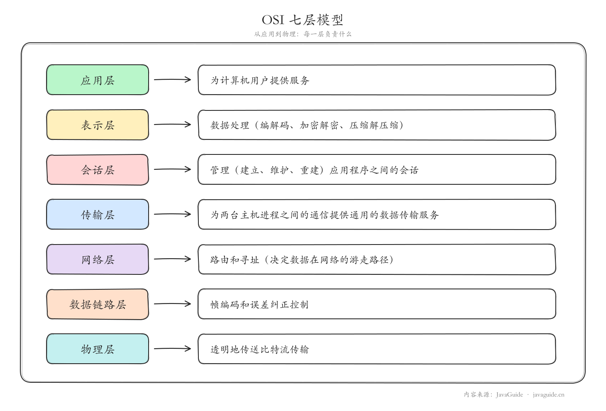
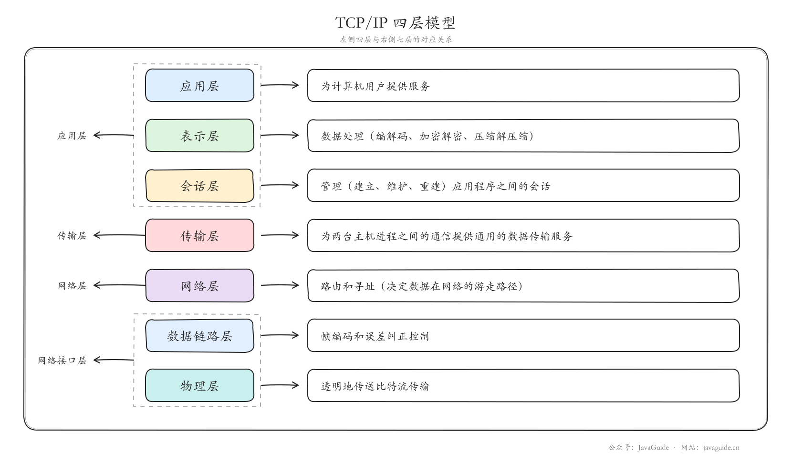
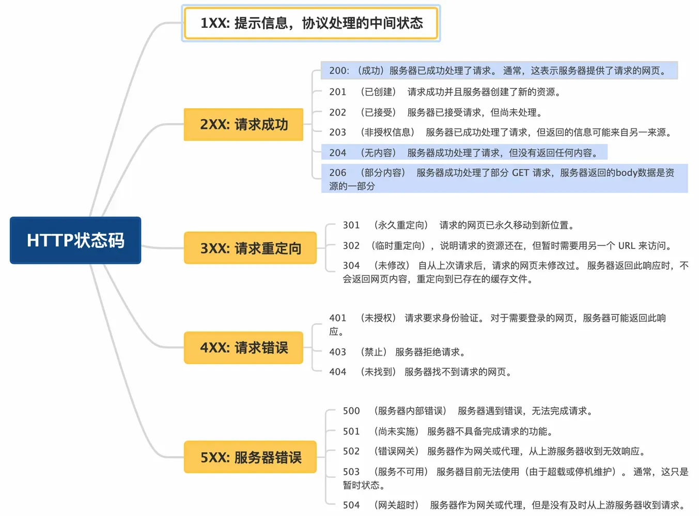

[小林Coding-图解计算机网络](http://xiaolincoding.com/network/)

[JavaGuide-计算机网络常见面试题总结](https://javaguide.cn/cs-basics/network/other-network-questions.html)

## 计算机网络基础
### 网络分层模型
#### OSI七层模型是什么？每一层的作用？
OSI 七层模型 是国际标准化组织提出的一个网络分层模型，其大体结构以及每一层提供的功能如下图所示：

### TCP/IP 四层模型是什么？每一层的作用是什么？
TCP/IP 四层模型 是目前被广泛采用的一种模型,我们可以将 TCP / IP 模型看作是 OSI 七层模型的精简版本，由以下 4 层组成：
- 应用层
- 传输层
- 网络层
- 网络接口层

对应关系如下：

### 常见网络协议
#### 应用层有哪些常见协议？
- HTTP（Hypertext Transfer Protocol，超文本传输协议）：基于 TCP 协议，是一种用于传输超文本和多媒体内容的协议，主要是为 Web 浏览器与 Web 服务器之间的通信而设计的。当我们使用浏览器浏览网页的时候，我们网页就是通过 HTTP 请求进行加载的。
- FTP（File Transfer Protocol，文件传输协议） : 基于 TCP 协议，是一种用于在计算机之间传输文件的协议，可以屏蔽操作系统和文件存储方式。注意 ⚠️：FTP 是一种不安全的协议，因为它在传输过程中不会对数据进行加密。建议在传输敏感数据时使用更安全的协议，如 SFTP。
- SSH（Secure Shell Protocol，安全的网络传输协议）：基于 TCP 协议，通过加密和认证机制实现安全的访问和文件传输等业务
- DNS（Domain Name System，域名管理系统）: 基于 UDP 协议，用于解决域名和 IP 地址的映射问题。

#### 传输层有哪些常见的协议？
- TCP（Transmission Control Protocol，传输控制协议 ）：提供面向连接的，可靠的数据传输服务。
- UDP（User Datagram Protocol，用户数据协议）：提供无连接的，尽最大努力的数据传输服务（不保证数据传输的可靠性），简单高效。

#### 网络层有哪些常见的协议？

- IP（Internet Protocol，网际协议）：TCP/IP 协议中最重要的协议之一，属于网络层的协议，主要作用是定义数据包的格式、对数据包进行路由和寻址，以便它们可以跨网络传播并到达正确的目的地。目前 IP 协议主要分为两种，一种是过去的 IPv4，另一种是较新的 IPv6，目前这两种协议都在使用，但后者已经被提议来取代前者。
● ARP（Address Resolution Protocol，地址解析协议）：ARP 协议解决的是网络层地址和链路层地址之间的转换问题。因为一个 IP 数据报在物理上传输的过程中，总是需要知道下一跳（物理上的下一个目的地）该去往何处，但 IP 地址属于逻辑地址，而 MAC 地址才是物理地址，ARP 协议解决了 IP 地址转 MAC 地址的一些问题。
## Http & Https
### Http
#### Http1.0与Http1.1比较
- HTTP1.0是短连接，每个请求和相应都需要独立的连接，频繁地建立/断开连接导致高延迟
- HTTP1.1 引入长连接，多个请求可以复用同一个TCP连接，减少每次请求建立TCP连接的消耗
#### Http1.1 与 Http2.0 比较
1. 多路复用
    - Http 1.1
        - 虽然是长连接(多个请求可以复用同一个TCP连接)但每个连接仍然是顺序处理请求的，浏览器仍然必须按顺序发送请求并等待响应返回后再发送下一个请求。这会导致请求之间的阻塞，尤其是在请求数目较多时；
        - 并且浏览器为了控制资源对同一域名设置有6-8个TCP连接数的上限限制，所以当请求数目较多时，Http1.1并不能很好的适配
    - HTTP 2.0 在同一TCP连接上可以同时传输多个请求和响应，互不干扰。这使得 HTTP 2.0 在处理多个请求时更加高效
2. 二进制帧
    - HTTP/1.1 则使用文本格式的报文
    - HTTP/2.0 使用二进制帧进行数据传输，二进制帧更加紧凑和高效，减少传输的数据量和带宽消耗
3. 头部压缩
    - HTTP/1.1 支持 Body 压缩，Header 不支持压缩
    - HTTP/2.0 支持对 Header 压缩，使用专门为 Header 压缩而设计的 HPACK 算法，减少网络开销
4. 服务器推送
    - HTTP/1.1 需要客户端自己发送请求来获取相关资源
    - HTTP/2.0 支持服务器推送，可以在客户端请求一个资源时，将其他相关资源一并推送给客户端，从而减少了客户端的请求次数和延迟

#### Http 2.0 与 Http 3.0 比较
1. 传输协议：
    - HTTP/2.0 是基于 TCP 协议实现的
    - HTTP/3.0 是基于 QUIC 协议实现的
2. 连接建立：
    - HTTP/2.0 需要经过经典的 TCP 三次握手过程，另外由于安全的 HTTPS 连接建立还需要 TLS 握手，连接建立耗时长 
    - HTTP/3.0 由于 QUIC 协议的特性连接建立仅需 0-RTT 或者 1-RTT，建立新连接耗时很短
        - 0-RTT：如果客户端在之前曾与服务器建立过连接并保存了必要的状态，它可以直接发送加密数据，跳过初始的握手步骤，从而实现接近零延迟的连接建立。
        - 1-RTT：如果是新的连接，客户端和服务器之间仍然需要一次往返通信来完成握手过程，相对于传统的三次握手和 TLS 握手，这已经大大减少了延迟。
3. 头部压缩：
    - HTTP/2.0 使用 HPACK 算法进行头部压缩
    - HTTP/3.0 使用更高效的 QPACK 头压缩算法
4. 队头阻塞：
    - HTTP/2.0 的多路复用即多请求复用一个 TCP 连接，一旦发生丢包，会阻塞住所有的 HTTP 请求
    - HTTP/3.0 由于QUIC协议的特性，一个连接建立多个不同的数据流，这些数据流之间独立互不影响，某个数据流发生丢包了，其它数据流不受影响，一定程度上解决了该问题
5. 连接迁移：
    - HTTP/2.0 基于 TCP 连接，TCP 连接是由 (源 IP，源端口，目的IP，目的端口) 组成，这个四元组中一旦有一项值发生改变，这个连接就不能用了
    - HTTP/3.0 支持连接迁移，因为 QUIC 使用 64位 ID 标识连接，只要 ID 不变就不会中断，网络环境改变时 (如从 Wi-Fi 切换到移动数据) 也能保持连接

#### HTTP状态码

重点的几个状态码：
- 200（成功）：客户端请求成功
- 301（永久重定向）：该资源已被永久移动到新位置，将来任何对该资源的访问都要使用本响应返回的若干个URL之一 
- 302（临时重定向）：请求的资源现在临时从不同的URI中获得 
- 304（未修改）：自上次请求后，请求的网页未修改过，服务器不返回网页内容，重定向到已存在的缓存文件
- 400（请求报文语法有误）：请求报文语法有误，服务器无法识别 
- 401（未授权）：请求需要认证 
- 403（禁止）：请求的对应资源禁止被访问 
- 404（未找到）：服务器无法找到对应资源 
- 500（服务器内部错误）：服务器内部错误
- 503（服务不可用）：服务器正忙

#### GET和POST请求的区别
**基本定义**
- GET：用于从服务器请求数据，通常用于获取资源或查询数据。GET 请求的参数通常附加在 URL 的查询字符串中。
- POST：用于将数据发送到服务器进行处理，通常用于提交表单或上传数据。POST 请求的参数包含在请求体中。

**参数传递方式**
- GET：参数附加在 URL 的查询字符串中（即 ?key=value&key2=value2 形式）。
- POST： 参数包含在请求体（body）中，通常用于表单提交或 JSON 数据传输。

**请求的可见性**
- GET：由于参数在 URL 中公开，因此容易被浏览器缓存或被查看。对于敏感信息，不建议使用 GET 请求传输（如密码）。
- POST：由于参数包含在请求体中，不直接暴露在 URL 中，虽然仍然可以通过工具查看请求体，但比 GET 请求更隐私。

**数据长度**
- GET：由于参数在 URL 中传递，GET 请求的 URL 长度受到浏览器和服务器的限制（一般最大长度为 2048 字符）。因此 GET 请求适合传输少量数据。
- POST：没有固定的长度限制，理论上可以传输大量数据，因此适合传输较大的数据（如文件上传、表单数据等）。

**幂等性**
- GET：GET 请求是 幂等的，这意味着多次执行相同的 GET 请求应该产生相同的结果，且不对服务器的资源状态造成改变。GET 请求应该只用于获取数据，不应有副作用。
- POST：POST 请求是 非幂等的，这意味着执行多次相同的 POST 请求可能会产生不同的结果，通常用于创建或更新资源。POST 请求可能改变服务器的状态或数据。

**缓存**
- GET：GET 请求通常是可缓存的，特别是当它们的 URL 完全相同时，可以被浏览器缓存，避免重复请求。
- POST：POST 请求通常不会被缓存，因为它通常会改变服务器的状态（例如提交表单或数据）。

**使用场景**
- GET：适用于获取资源、查询信息、进行简单的检索等。常用于浏览器中打开页面时的请求。
- POST：适用于提交数据、创建资源、上传文件、提交表单数据等。通常用于用户提交的表单或需要改变服务器状态的操作。

**安全性**
- GET：由于参数显示在 URL 中，所以不适合传递敏感信息。比如密码、信用卡号等。
- POST：虽然 POST 请求的参数不显示在 URL 中，能够较好地隐藏数据，但数据本身仍然是明文的，除非使用 HTTPS 协议加密通信。POST 请求并不等于加密通信。

**可重复性**
- GET：GET 请求可以通过浏览器的刷新按钮（F5）或书签进行重复调用，且不会对数据产生副作用。
- POST：POST 请求通常不能通过刷新或书签来重复执行，因为它可能会导致数据重复提交（例如，提交两次相同的订单）。

|特性|GET|POST|
|特性|GET|POST|